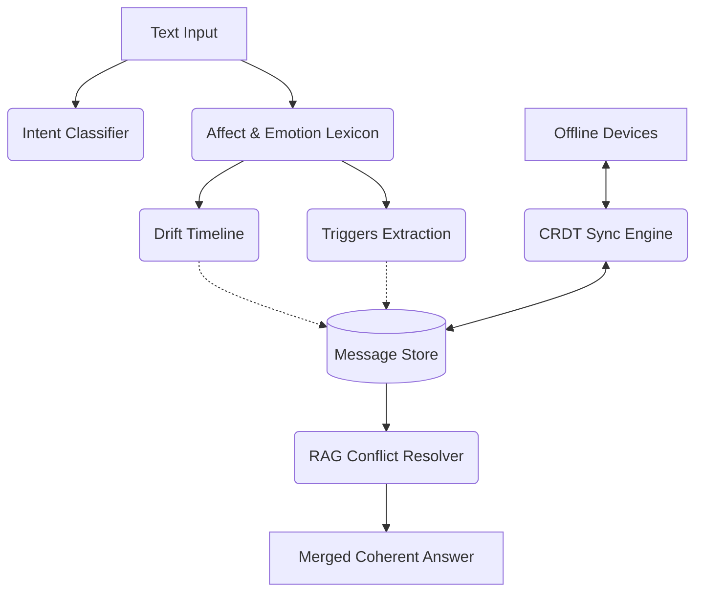

# Kastack Round 2

Round 2 of the Kastack architecture introduces continuous context, shifting emotional arcs, intent-based routing, and a multi-device data sync layer. Instead of a basic vector search over isolated documents, this architecture treats user history as a living stream of evolving sentiments, allowing the assistant to understand both **what** was said and **how feelings changed over time**. It includes four primary subsystems: Intent Classification, Affect & Drift Detection, RAG Conflict Resolution, and Offline CRDT Sync.

## Architecture



## How to Run
Run the full demonstration application:
```bash
python -m streamlit run round2/app.py
```

Run the automated test suite:
```bash
python -m pytest round2/tests -v
```

## Data Caveat
The PersonaChat dataset, originally used for training in this project, consists of disconnected day-to-day chats where "days" are actually separate pairs of people talking. Treating it as a single continuous user history is biologically/socially incorrect and results in massive topical and emotional whiplash. The drift engine has been validated instead on a curated synthetic Demo Arc and real WhatsApp/Telegram exports.
