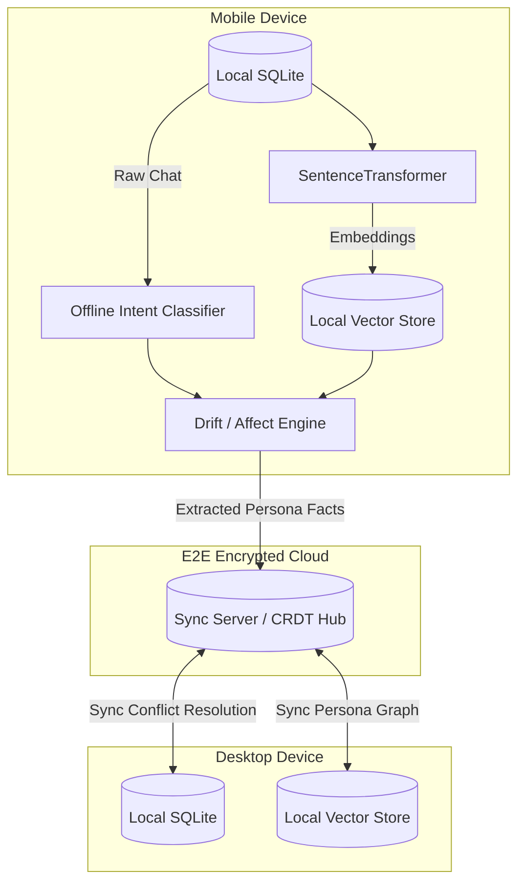

# Kastack Sync Architecture Design

## 1. Overview
Kastack's multi-device architecture focuses on privacy-first on-device processing, ensuring that sensitive conversational data remains localized while allowing logical synchronization of persona traits, knowledge graphs, and interaction histories.

## 2. Storage Strategy
- **On-Device Storage (Local):** 
  - Uses a lightweight local SQLite database (or Realm/Room for mobile) to store raw conversation logs (`processed_messages.jsonl`).
  - L2-normalized embeddings (`embeddings.npy`) are stored entirely locally to prevent exposing semantic vectors over the wire.
  - The offline Intent Classifier (LinearSVC + TF-IDF, < 50MB) runs completely on-device, analyzing messages directly on the CPU without any network roundtrips.

- **Cloud Storage (Encrypted Sync):**
  - Stores a minimal synced footprint: hashed user IDs, high-level extracted topics (`topic_segments.json`), and derived persona profiles (`persona.json`).
  - No raw chat messages are synchronized to the cloud.

## 3. What Syncs vs. What Stays Local

### **Stays Local (Never Leaves Device)**
- Raw chat text / message history.
- Real-time `emotion.py` affect scores per message (Valence, Frustration, Playfulness).
- Raw dense embeddings generated by `SentenceTransformer`.
- Local intent classifications.

### **Syncs to Cloud (End-to-End Encrypted)**
- **Topic Markers & Change-Points:** Timestamps of when new topics or relationship entities (e.g., "sister") were introduced.
- **Aggregated Persona Graph:** High-level facts learned about the user (e.g., "Likes archery", "Has 2 sisters").
- **Conflict Resolution Metadata:** Rules mapping which device has authority over specific persona facts.

## 4. Conflict Resolution: Options & Trade-offs
When multiple devices (e.g., Phone and Laptop) update the persona graph concurrently, Kastack requires a mechanism to reconcile diverging facts.

### A) Last-Write-Wins (LWW)
- **PROS:** Extremely simple to implement. Requires only a wall-clock timestamp for each fact.
- **CONS:** Susceptible to clock skew across devices. Destructive (silently overwrites previous facts, causing data loss).

### B) Vector Clocks
- **PROS:** Accurately detects causal relationships and concurrent edits.
- **CONS:** Metadata overhead scales linearly with the number of devices. Requires manual intervention or application-level logic to resolve siblings.

### C) Conflict-free Replicated Data Types (CRDTs)
- **PROS:** Mathematically guarantees eventual consistency without central coordination. Perfect for offline-first local data manipulation.
- **CONS:** High implementation complexity. Memory overhead for tombstoning deleted facts.

### Why We Chose CRDTs
Kastack employs an Event-Sourced CRDT approach because this is an **append-mostly journaling use case**. Since the core experience hinges on *tracking the evolution* of a persona over time, silent destruction of data (LWW) is unacceptable. CRDTs allow devices to function fully offline, capturing affect scores and new persona entities, and mathematically merging them without losing the timeline of emotional shifts when reconnected.

To handle logical conflicts within the CRDT:
1. **Logical Timestamps:** Each extracted fact is tagged with a Hybrid Logical Clock (HLC) timestamp.
2. **Emotional Weighting:** If two devices infer contradictory facts (e.g., "I have 1 sister" vs "I have 2 sisters") concurrently, the resolver uses the `emotional_weight` of the source messages as a tie-breaker. Facts derived from highly emotional/intense messages override passive mentions.

## 5. System Diagram

